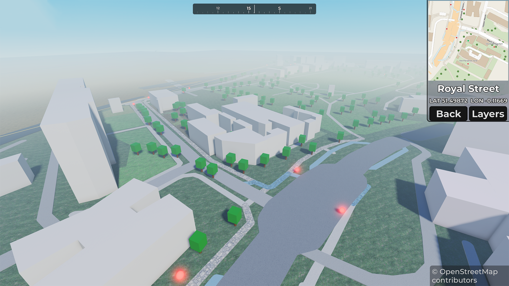
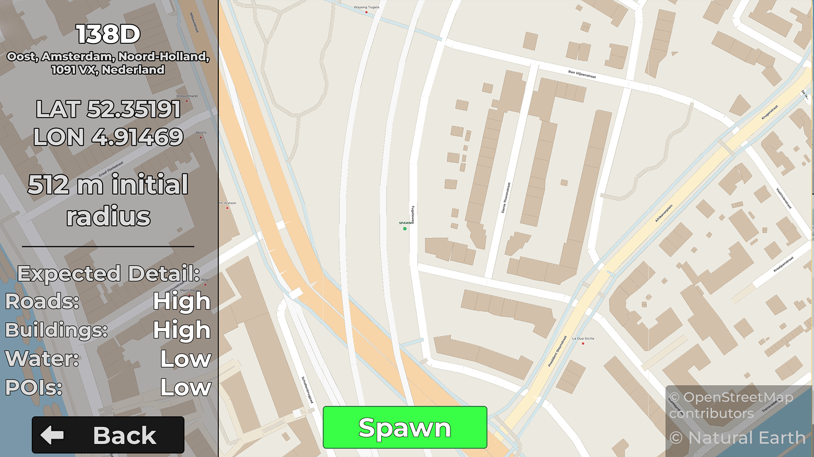
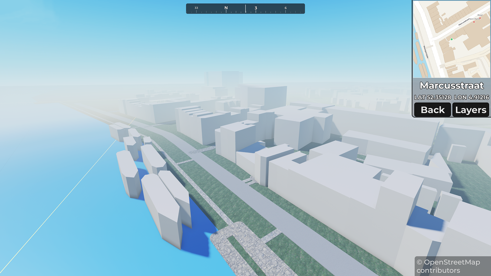
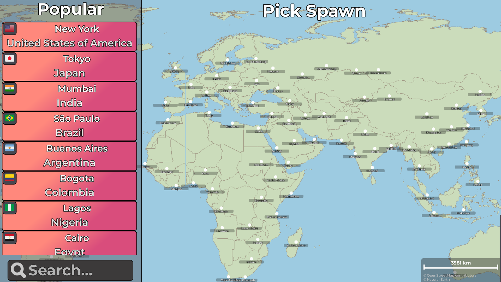
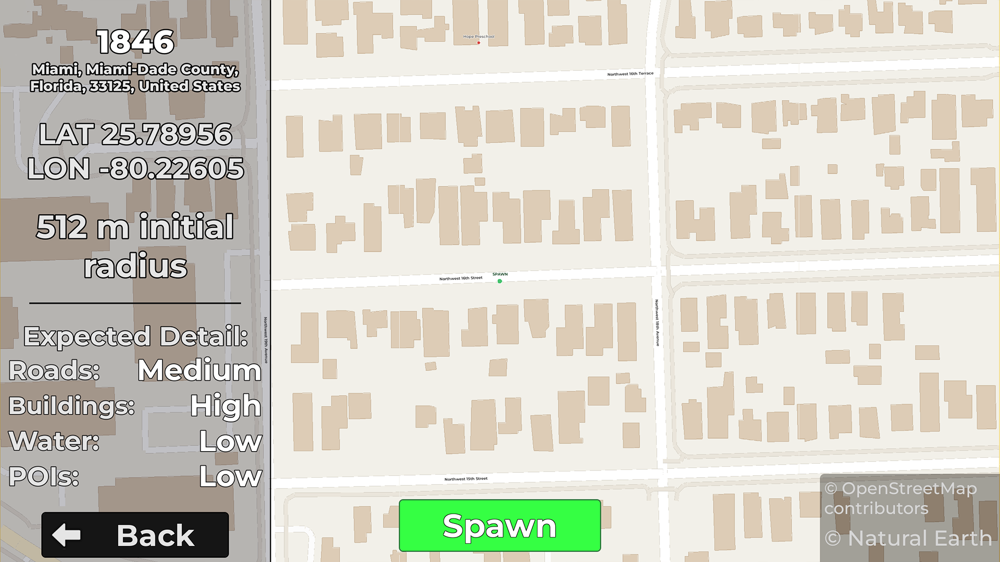
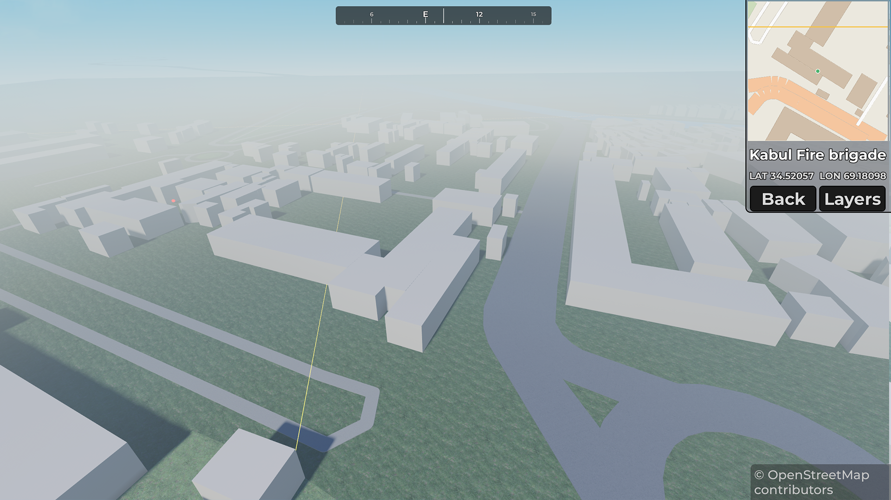

# 🌍 The World, 1:1 Scale

[Uncopylocked Roblox Release](https://www.roblox.com/games/78467455587350/The-World-1-1-Scale)

**The World, 1:1 Scale** is an open-source Roblox systems showcase that generates explorable 3D environments from real-world OpenStreetMap data.

Pick a location on the world map, confirm your spawn point, and explore a minimalist Roblox reconstruction of the real world - with roads, buildings, water, landuse, trees, points of interest, and more rendered from map data.

This public version is designed to be self-contained and does **not** require a private backend. It directly requests data from the Overpass API from within Roblox Studio / Roblox server scripts, making it easier to inspect, run, modify, and learn from.



## ✨ What is this?

This project is a Roblox game showcase that lets players explore real places through procedural map generation.

The flow is simple:

1. Open the interactive world map.
2. Drag, zoom, browse cities, or pick a popular place.
3. Select almost anywhere on Earth.
4. Confirm the spawn location.
5. The game fetches OpenStreetMap data.
6. Roblox renders the selected area into a playable 3D environment.

The visual style is intentionally clean and minimal. The goal is not photorealism - it is to show the structure of real-world places through roads, buildings, water, parks, forests, POIs, and other map features.



## 🎮 Features

* 🌐 Interactive world map with dragging and zooming using Natural Earth data
* 📍 Spawn selection by map click, popular places, or random location
* 🏙️ City labels using Natural Earth data
* 🔎 Zoom-dependent city visibility based on importance and spacing
* 🧭 Spawn confirmation screen with local map preview
* 🛣️ Real OpenStreetMap road rendering
* 🏢 Building footprint rendering
* 🌊 Water feature rendering
* 🌳 Trees and natural features
* 🟩 Landuse rendering, including parks, forests, and other mapped areas
* 📌 Points of interest rendering
* 🎛️ Layer tab for toggling rendered feature types
* 🗺️ In-game minimap
* 🧩 Modular renderer architecture
* 🧪 Open-source direct Overpass data mode
* 🔓 Is compatible with the [uncopylocked Roblox release](https://www.roblox.com/games/78467455587350/The-World-1-1-Scale)



## 🧠 Project goals

This project was created as a Roblox systems-development showcase piece.

The main goals were to explore:

* real-world geospatial data inside Roblox
* converting latitude/longitude data into local Roblox space
* rendering OpenStreetMap features procedurally
* building an interactive world-selection UI
* handling large generated environments
* designing a modular runtime map renderer
* creating a showcase that is technically interesting but still explorable by players

The result is a hybrid between a world map, a procedural generation system, and a technical visualization tool.



## 🏗️ How it works

At a high level:

```text
Player selects a location
        ↓
Roblox builds an Overpass query
        ↓
OpenStreetMap data is fetched from Overpass API
        ↓
Raw map data is parsed and filtered
        ↓
Map features are converted into Roblox-friendly data
        ↓
Client-side renderers generate the 3D world
        ↓
The player explores the generated location
```

The public open-source version queries Overpass directly. This keeps the project easy to run without needing a private backend, database, API key, or hosted service.

---

## 🧭 Game flow

### 1. World map

Players start on an interactive world map.

The map supports:

* dragging around the world
* zooming in and out
* selecting popular places
* clicking almost anywhere to choose a spawn point
* city labels that appear based on zoom level and importance

Both the world map and city data is based on Natural Earth data and is used to make the map feel alive without needing live geocoding for every label.

---

### 2. Confirm spawn

After selecting a spawn location, the game fetches nearby map data and displays a preview of the area.

This screen acts as a transition between the global map and the generated 3D world.

It shows:

* selected coordinates
* selected location name, when available
* a local preview map
* available map layers
* loading status

---

### 3. Generated world

Once the player spawns, the game renders the selected real-world area inside Roblox.

Supported rendered layers include:

* roads
* buildings
* water
* landuse
* trees
* points of interest

The world is rendered client-side, allowing the game showcase to display large amounts of visual geometry without relying on server-side replicated map parts for every feature.

---

### 4. In-game tools

The in-game UI includes:

* minimap
* layer controls, modifying what features are displayed on the generated map
* map feature toggles
* location context
* optional debug information

The layer system allows players and developers to inspect how the generated world is built.

---

## 🧩 Architecture

The project is structured around a few major systems.

```text
World Map UI
  Handles global map interaction, zooming, dragging, city labels, and spawn selection.

Spawn Confirmation UI
  Displays selected location details and previews nearby map data.

Overpass Data Provider
  Requests raw OpenStreetMap data directly from the Overpass API.

Map Data Parser
  Converts raw OSM elements into simplified internal feature data.

Coordinate Conversion
  Converts real-world latitude/longitude coordinates into local Roblox coordinates.

Render Pipeline
  Turns processed map features into Roblox geometry.

Layer System
  Enables or disables roads, buildings, water, landuse, trees, and POIs.

Minimap
  Displays player position and nearby generated context.

Client Renderers
  Render the generated world locally on the client.
```

## ⚠️ Important note about Overpass API

This open-source version directly requests OpenStreetMap data through the Overpass API.

Overpass is a public shared service. Because of that:

* loading can be slow
* requests may fail or time out
* dense cities may take longer to generate
* requesting many areas quickly may trigger rate limits
* this direct mode is not ideal for high-traffic production use

This is expected behavior for the public open-source version.

For a production-scale version, a caching backend is recommended. A backend can pre-process OpenStreetMap data, strip unnecessary fields, cache generated chunks, and serve Roblox-ready payloads much faster than direct Overpass requests.

---

## 🧪 Why does the public version use direct Overpass requests?

During development, a backend-based architecture can provide better performance through caching and preprocessing.

However, this open-source version intentionally avoids requiring a private backend because it makes the project:

* easier to run
* safer to publish
* easier to inspect
* easier to modify
* compatible with the [uncopylocked Roblox release](https://www.roblox.com/games/78467455587350/The-World-1-1-Scale)
* free from private credentials or API secrets

The public version prioritizes transparency and accessibility over production-level loading performance.

---

## 🧱 Rendered map layers

### Roads

Roads are generated from OpenStreetMap road data and rendered as stylized paths in Roblox.

Different road types can be interpreted differently, such as:

* major roads
* residential roads
* service roads
* paths
* pedestrian routes

---

### Buildings

Buildings are generated from OpenStreetMap building footprints.

Depending on the available data, buildings may use:

* footprint geometry
* building type
* estimated height
* level count, when available

The rendering style is intentionally minimal, giving the generated world a clean architectural-model feel.

---

### Water

Water features can include:

* rivers
* lakes
* coastline-related areas
* mapped water polygons

These are rendered as separate visual layers so they can be toggled independently.

---

### Landuse

Landuse data helps give areas more context.

Examples include:

* parks
* forests
* grass areas
* commercial zones
* industrial zones
* residential zones

---

### Trees

Trees may be generated from mapped natural data or inferred from relevant landuse/natural areas, depending on the implementation.

---

### Points of interest

POIs help identify notable mapped locations.

Examples may include:

* landmarks
* stations
* public buildings
* attractions
* amenities
* named map features

---

## 🎛️ Layer controls

The in-game layer tab allows players to enable or disable different parts of the generated world.

This is useful both for gameplay and for understanding how the map is built.

Example layers:

* Roads
* Buildings
* Water
* Landuse
* Trees
* POIs

---

## 🗺️ Minimap

The minimap helps players orient themselves inside the generated area.

It can show:

* player position
* nearby generated features
* selected location context
* movement direction
* local map layout

## 🧱 Performance notes

This project can generate a lot of Roblox instances, especially in dense urban areas.

Performance depends on:

* selected location
* map density
* number of buildings, roads, trees
* enabled layers
* client device performance
* Overpass API response time

---

## 🚧 Known limitations

This open-source version has several intentional limitations:

* No private caching backend
* No external database
* Direct Overpass requests can be slow
* Overpass may rate-limit or reject requests
* Very dense cities may take a long time to load
* Some OSM relation geometry may not render perfectly
* Generated worlds are stylized, not photorealistic
* Height data may be missing or estimated
* Map data quality depends on OpenStreetMap coverage for the selected area

These limitations are part of the current public version and are acceptable for a transparent open-source showcase.

---

## 🛣️ Possible future improvements

Potential future additions:

* processed chunk caching
* backend cache provider
* support for multiple map data providers
* improved local map preview performance
* better building extrusion
* more advanced road rendering
* terrain elevation support
* route/path visualization
* improved POI labels
* map-data debug mode
* city/region presets
* screenshot/cinematic mode

---

## 🔐 Backend note

This repository does not include a private hosted backend.

The public version is intentionally built around direct Overpass API access so that it can be open sourced safely.

A production deployment should replace the direct Overpass provider with a backend provider that:

* requests Overpass or another OSM-derived data source
* caches raw map responses
* processes map data server-side
* strips unnecessary tags and metadata
* serves compact Roblox-ready chunks
* reduces loading time
* reduces rate-limit issues

The codebase can be extended in that direction, but no private backend is required for this version.

---

## 🧭 OpenStreetMap attribution

This project uses OpenStreetMap (OSM) data for rendering the map. OpenStreetMap is built by a community of contributors that maintain mapping data across the world. 
OpenStreetMap data is licensed under the OpenData Commons Open Database License (ODbL) by the OpenStreetMap Foundation (OSMF). Data users are free to copy, distribute, transmit and adapt our data, as long as you credit OpenStreetMap and its contributors.

You are required to provide a clear attribution wherever OpenStreetMap data is used, like:

```text
© OpenStreetMap contributors
```

Please preserve OpenStreetMap attribution in any public version, fork, or derivative game showcase that uses OSM data.

More info: [OpenStreetMap Copyright](https://www.openstreetmap.org/copyright)

---

## 🌐 Natural Earth attribution

This project uses Natural Earth data for the world map, country border and city label data.

Natural Earth is a map dataset that is completely in the public domain. As such, attribution is not legally required.
However, I have chosen to include the attribution where applicable, primarily to help others discover the data.

More info: [Natural Earth Terms of Use](https://www.naturalearthdata.com/about/terms-of-use/)

---

## 📜 License

This project is released under the MIT License.

See `LICENSE` for details.

---

## 💬 Final note

This project is not trying to recreate the entire world photorealistically.

It is a systems showcase: a Roblox game that takes real-world map data, processes it, and turns it into an explorable generated environment.

Pick a place, spawn in, toggle the layers, and see what the real world looks like when it becomes a Roblox map.
